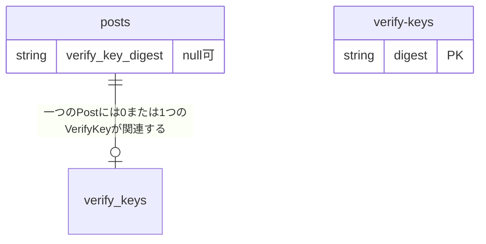

# データベース設計

## テーブル

- `posts`: 投稿一覧
- `verify-keys`: 検証用鍵の保管

### `posts`
投稿一覧を保管するテーブル。

`created_at`にインデックスを貼るといいらしい by Copilot

### `verify_keys`
本人確認用の認証システムに使う、検証用鍵。
署名付きの投稿がされるたびにここから鍵を引っ張り出し、検証する。

もし一定期間したら削除できるのなら、削除してもいいかも。

`created_at`にインデックスを貼るといいらしい by Copilot

## リレーション
- 一つの`post`に対して、0~1つの`verify-key`がある
- 一つの`verify_key`に対して、0~*つの`post`がある

